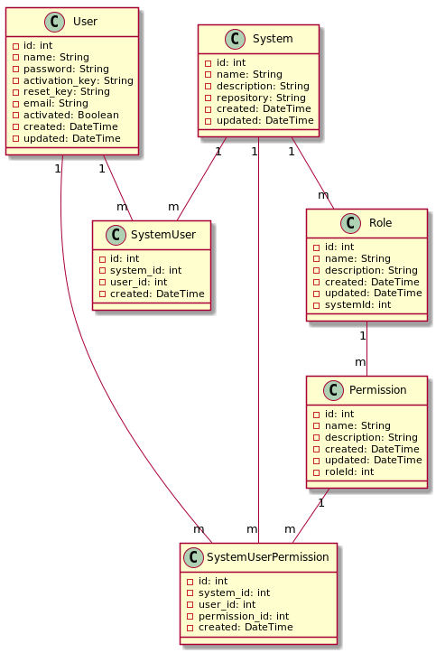

# Accesos con Golang y SQL

- [Accesos con Golang y SQL](#accesos-con-golang-y-sql)
  - [Configuraciones y Scripts](#configuraciones-y-scripts)
    - [Golang](#golang)
    - [Antes de usar los scripts](#antes-de-usar-los-scripts)
    - [Archivo .env](#archivo-env)
    - [Migraciones con DBMATE](#migraciones-con-dbmate)
    - [Imágnes de PlantUML](#imágnes-de-plantuml)
  - [Documentación](#documentación)

## Configuraciones y Scripts

### Golang

Instalar asdf (si no lo tienes)
    
    git clone https://github.com/asdf-vm/asdf.git ~/.asdf --branch v0.14.0

Agrega asdf al shell (si usas bash)

    echo -e '\n. "$HOME/.asdf/asdf.sh"' >> ~/.bashrc
    echo -e '\n. "$HOME/.asdf/completions/asdf.bash"' >> ~/.bashrc
    source ~/.bashrc

Instalar plugin de Go

    $ asdf plugin add golang https://github.com/asdf-community/asdf-golang.git

Instalar una versión de Go (ejemplo: 1.22.0)

    $ asdf install golang 1.23.0

Establecer la versión de Go global o local
  
    $ asdf global golang 1.23.0   # para todo el sistema
    $ asdf local golang 1.23.0    # para un proyecto específico

Verifica instalación
    
    go version

Instalar dependencias de go:
   
    $ go get github.com/gin-gonic/gin
    $ go get -u gorm.io/gorm
    $ go get -u gorm.io/driver/sqlite
    $ go get github.com/gin-contrib/sessions
    $ go get github.com/gin-contrib/sessions/cookie
    $ go get -u github.com/golang-jwt/jwt/v5
    $ go get github.com/joho/godotenv/cmd/godotenv

### Antes de usar los scripts

    $ pip install faker

### Archivo .env

    #### DBMATE
    DB=sqlite:db/app.db
    #### GORM
    DB_DRIVER=sqlite
    DB_NAME=db/app.db
    # Para otros motores de BD:
    # DB_HOST=localhost
    # DB_PORT=5432
    # DB_USER=user
    # DB_PASSWORD=pass
    # DB_SSL_MODE=disable
    #### APP
    BASE_URL=http://localhost:8080
    STATIC_URL=http://localhost:8080/static
    #### SEGURIDAD
    APP_NAME=PipsAuthz
    ADMIN_USERNAME=admin
    ADMIN_PASSWORD=123
    JWT_SECRET=mi_secreto_jwt_fuerte
    AUTH_HEADER=dXNlci1zdGlja3lfc2VjcmV0XzEyMzQ1Njc
    PORT=5000
    SECURE=false
    MAX_FILE_SIZE_MB=5
    ALLOWED_FILE_EXTENSIONS=pdf,jpg,png,docx,jpeg
    ALLOWED_ORIGINS=https://tudominio.com,http://localhost:8000
    ALLOWED_METHODS=GET,POST,PUT,DELETE,OPTIONS
    ALLOWED_HEADERS=Content-Type,Authorization,X-Requested-With
    CORS_ENABLED=true
    
### Migraciones con DBMATE

Instalar dependencias:

    $ npm install

Crear migración:

    $ npm run db:new <nombre-migración>

Ejecutar

    $ npm run db:up

Deshacer

    $ npm run db:rollback

Ejemplos de código en Sqlite3

```sql
-- Crear una entidad fuerte
CREATE TABLE paises (
  id INTEGER NOT NULL PRIMARY KEY AUTOINCREMENT,
  nombre VARCHAR(40) NOT NULL,
  bandera_url VARCHAR(100) NOT NULL,
  gentilicio VARCHAR(30) NOT NULL
);
-- Crear una entidad debil
CREATE TABLE recurso_coleccion (
  id	INTEGER NOT NULL PRIMARY KEY AUTOINCREMENT,
  coleccion_id INTEGER NOT NULL,
  recurso_id INTEGER NOT NULL,
  FOREIGN KEY (coleccion_id) REFERENCES coleccion (id),
  FOREIGN KEY (recurso_id) REFERENCES recurso (id)
);
```

### Imágnes de PlantUML

Generar UMLs:

    $ chmod +x scripts/render_all_puml.sh
    $ ./scripts/render_all_puml.sh


project/
├── cmd/
│   └── app/
│       └── main.go          # Punto de entrada
├── internal/
│   ├── domain/              # Modelos del dominio
│   │   ├── user.go
│   │   └── file.go
│   ├── handlers/            # Controladores HTTP
│   │   ├── auth_handler.go
│   │   ├── file_handler.go
│   │   └── handler.go       # Base handler
│   ├── forms/               # Estructuras de validación
│   │   ├── auth_form.go
│   │   └── file_form.go
│   ├── services/            # Lógica de negocio
│   │   ├── auth_service.go
│   │   ├── file_service.go
│   │   └── interfaces.go    # Interfaces de servicios
│   ├── repositories/        # Acceso a datos
│   │   ├── user_repo.go
│   │   └── file_repo.go
│   └── config/              # Configuración
│       └── config.go
├── pkg/
│   ├── middleware/          # Middlewares
│   └── utils/               # Utilidades compartidas
├── go.mod
├── go.sum
└── README.md

---

## Documentación

Diagrama de clases

